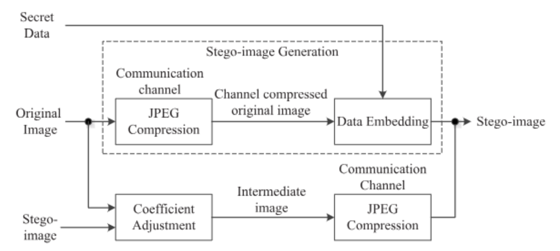
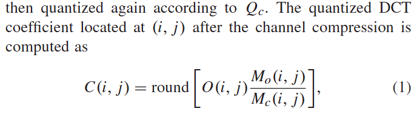
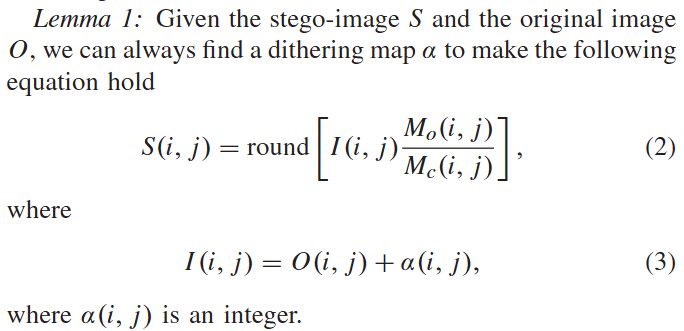
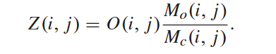
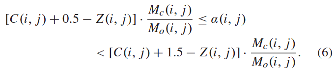
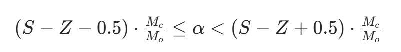
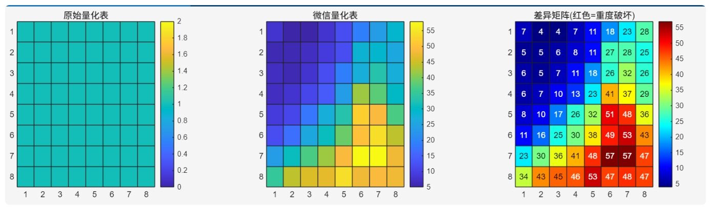
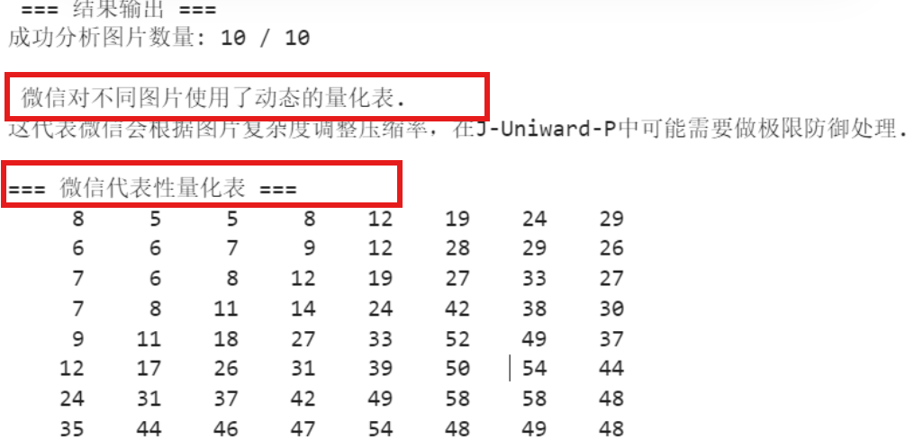

| 学号     | 姓名   |
| -------- | ------ |
| 23336029 | 陈宝怡 |
| 23336049 | 陈意欣 |

## 一、实验目的与要求
本次大作业旨在研究解决图像隐写在经历JPEG重压缩以及社交网络真实传播信道下的鲁棒性问题，具体要求报告
- 以 ***Towards Robust Image Steganography*** 的工作为基础，学习并尝试复现其中提出的基于J-Uniward和J-Uniward-P的系数调整鲁棒隐写框架，重测论文结果。
- 针对真实社交网络（本实验中使用微信），分析其压缩机制。设计一套鲁棒隐写算法，并测试实际上传10张载密图像的BER。根据实验结果，讨论该算法的实际可用性。
- 实验使用的数据集为：BOSSbase-1.01和UCID
## 二、实验原理与算法设计
### 1、论文鲁棒框架复现
随着社交网络的普及，图像在传输过程中普遍会经历 JPEG 重压缩等有损处理，传统隐写算法在这类信道下极易出现秘密信息提取错误。论文提出的鲁棒隐写框架，通过**J-UNIWARD-P**与**系数调整策略**，解决了隐写信息在二次压缩信道下的漂移问题，实现了无差错提取。本实验严格复现该框架，并对比分析基础版与鲁棒版 J-UNIWARD 的性能差异。

#### 1.1 系数调整函数 `adjust_coefficients`

```matlab
function I_coef = adjust_coefficients(O, S, qt_o, qt_c)
```
系数调整是论文实现零差错提取的关键，其核心目标是构造中间图像 I，使其满足约束条件（下），保证中间图像 I 经信道压缩后，DCT 系数必然等于 S，从而消除重压缩带来的系数漂移。函数输入原图 DCT 系数 O、载密系数 S、原图量化表 qt_o、信道量化表 qt_c，输出**中间图 I 系数**。下面是论文公式具体推导
- **信道压缩公式**

- **约束条件**

- **中间变量 Z**

根据以上公式，且

可以得出调整量 α 满足：

将上述推导结果转化为具体Matlab脚本实现：
```matlab
% 定位 8×8 块内位置，获取当前系数的量化步长
mo = qt_o(mod(i-1,8)+1, mod(j-1,8)+1);
mc = qt_c(mod(i-1,8)+1, mod(j-1,8)+1);
z = O(i,j) * mo / mc;
alpha = round((S(i,j) - z) * mc / mo);
I_coef(i,j) = O(i,j) + alpha;
```
该过程满足约束 $S = \text{round}(I \cdot M_o / M_c)$，确保中间图像经信道 JPEG 压缩后与载密图像完全一致，从而实现秘密信息的 100% 准确提取，与论文引理 1 及核心框架完全吻合。
#### 1.2 J‑UNIWARD 代价函数 `get_juniward_cost`
```matlab
function rho = get_juniward_cost(cover_jpg)
```
**J-UNIWARD 是经典的 JPEG 隐写代价函数**，通过计算图像在三个方向的小波残差，衡量每个 DCT 系数修改对图像视觉质量的影响，优先选择残差变化小的位置嵌入秘密信息。
使用Matlab函数实现计算 J‑UNIWARD 嵌入代价过程，用于 STC 编码嵌入。
```matlab
% J-Uniward 方向滤波器
lpdf = [-0.0544153492, 0.3125, 0.6875, -0.1875];
hpdf = [-0.1875, -0.6875, 0.3125, 0.0544153492];

Fh = lpdf' * hpdf;
Fv = hpdf' * lpdf;
Fd = hpdf' * hpdf;

R_h = imfilter(img, Fh, 'symmetric');
R_v = imfilter(img, Fv, 'symmetric');
R_d = imfilter(img, Fd, 'symmetric');

% 代价
rho = abs(R_h) + abs(R_v) + abs(R_d);
rho = imresize(rho, size(coef));
```
- 代价 = 三个方向残差绝对值之和
- 缩放到 DCT 系数尺寸，用于嵌入
#### 1.3 J‑UNIWARD‑P 鲁棒代价 `get_juniward_p_cost`
```matlab
function rho = get_juniward_p_cost(cover_jpg_path)
```
J-UNIWARD-P 是论文提出的鲁棒改进版本，与基础版仅衡量视觉失真不同，它**模拟了嵌入修改对 JPEG 压缩鲁棒性的影响**。
使用Matlab函数实现论文提出的**鲁棒版代价**，考虑 JPEG 压缩影响。
```matlab
c = coef(i,j);
coef1 = coef; coef1(i,j) = c+1;% 模拟+1修改
img1 = block_idct(coef1);% 重建图像
```
对每个 DCT 系数，模拟 + 1 修改并重建图像，看**压缩后的变化**
```matlab
R1_1 = imfilter(img1,F1,'symmetric');
R2_1 = imfilter(img1,F2,'symmetric');
R3_1 = imfilter(img1,F3,'symmetric');

d1 = mean(abs(R1_1-R1)./(abs(R1)+sgm));
d2 = mean(abs(R2_1-R2)./(abs(R2)+sgm));
d3 = mean(abs(R3_1-R3)./(abs(R3)+sgm));

rho(i,j) = d1+d2+d3;
```
- **鲁棒代价**：修改后引起的**全局残差变化量**。
- 变化率越大，说明该系数对压缩越敏感，赋予高代价，避免嵌入。
#### 1.4 论文抗JPEG重压缩隐写框架
为实现表一中的零代码提取，论文提出了一套完全抗 JPEG 重压缩的隐写框架，其核心步骤如下：
- 先在**信道压缩后的原图**上嵌入秘密信息，得到目标载密图 S。
- 提出**系数调整策略**，构造中间图 I，使其经信道压缩后**精确等于** S。
- 理论证明该构造**一定存在**，可实现**100% 准确提取**，无需纠错码。
为验证鲁棒框架的有效性、复现表一，实验中首先实现了传统 J‑UNIWARD 隐写的嵌入‑传输‑提取流程，不使用鲁棒框架、不使用系数调整，作为论文中的基线对比算法。
```matlab
function ber = embed_extract(cover_jpg, rho, payload, Qc)
    jpg = jpeg_read(cover_jpg);
    cover_coef = jpg.coef_arrays{1};
    
    nbits = round(nnz(cover_coef) * payload);
    msg = randi([0 1], nbits, 1);
    
    stego_coef = stc_embed(cover_coef, rho, msg, payload);
    jpg.coef_arrays{1} = stego_coef;
    jpeg_write(jpg, 'result/stego_temp.jpg');
    
    Ist = imread('result/stego_temp.jpg');
    imwrite(Ist, 'result/recompress.jpg', 'Quality', Qc);
    
    jpg2 = jpeg_read('result/recompress.jpg');
    recoef = jpg2.coef_arrays{1};
    
    msg_ext = stc_extract(recoef, cover_coef, rho, payload);
    ber = sum(xor(msg, msg_ext)) / length(msg_ext);
end
```
- 读取信道压缩后的载体图像，获取其 DCT 系数。
- 根据有效非零 AC 系数数量计算嵌入长度，生成随机秘密比特序列。
- 调用 STC 嵌入函数，按照代价最小原则修改 DCT 系数。
- 将载密系数写入图像，保存载密图像。
- 模拟信道传输对载密图像进行二次 JPEG 压缩。从重压缩图像中提取系数并提取秘密信息。
- 计算误码率 BER。
接着进一步实现**鲁棒隐写框架**，进行 J‑UNIWARD‑P 代价 + 系数调整 + 信道压缩。与上面函数基本相同，多了系数调整，使二次压缩后的系数不变，实现抗压缩鲁棒隐写。通过该步骤，算法主动补偿了二次量化带来的步长差异，确保了经历信道后的系数稳健性。
```matlab
% 前置嵌入流程与基线算法相同，得到理想的载密系数 S_coef
jpg_o = jpeg_read(cover_Qo_jpg);
O_coef = jpg_o.coef_arrays{1};
qt_o = jpg_o.quant_tables{1};
qt_c = jpg_c.quant_tables{1};
I_coef = adjust_coefficients(O_coef, S_coef, qt_o, qt_c);
```
- 获取原始系数 O、原始量化表、信道量化表，实现系数调整。
#### 1.5 核心复现流程设计
为自动化测试批量数据并生成类似论文表一的对比结果，设计一份测试脚本，该流程将通过控制变量（压缩质量与载荷大小）：
1. 配置论文实验参数（数据集、压缩质量、载荷）
2. 遍历所有测试图像：
   a. 读取图像并缩放为 256×256
   b. 生成原始高质量图像 cover_Qo.jpg
   c. 生成信道压缩图像 channel_Qc.jpg
   d. 计算传统 J-UNIWARD 代价并测试 BER
   e. 计算鲁棒 J-UNIWARD-P 代价并测试 BER
   f. 记录每张图像的 BER
3. 统计所有图像的平均 BER 并输出最终结果
将上述过程转化为Matlab脚本进行测试。
```matlab
% 1. 生成 Qo 图像
imwrite(I, 'result/cover_Qo.jpg', 'Quality', Qo);

% 2. 生成信道压缩 Qc 图像
I_qo = imread('cover_Qo.jpg');
imwrite(I_qo, 'result/channel_Qc.jpg', 'Quality', Qc);

% 2.1 使用算法1：传统 J-UNIWARD 
rho_normal = get_juniward_cost('result/channel_Qc.jpg');
[ber_normal] = embed_extract('result/channel_Qc.jpg', rho_normal, payload, Qc);

% 2.2 算法2：鲁棒 J-UNIWARD-P
rho_robust = get_juniward_p_cost('result/channel_Qc.jpg');
[ber_robust] = robust_embed_extract('result/cover_Qo.jpg', 'result/channel_Qc.jpg', rho_robust, payload, Qo, Qc);

% 3. 保存 BER
BER_normal(case_idx, img_idx) = ber_normal;
BER_robust(case_idx, img_idx) = ber_robust;
```
### 二、真实社交环境鲁棒隐写算法验证
上述步骤是在验证基于理想模拟环境下的J-Uniward-P算法表现，其中二次压缩量化表QT是已知的。但在初次测试真实微信传输中，我们发现这个过程呈现出极强的黑盒特性，使得实验结果与理论偏差巨大，具体表现为：
- 使用J-Uniward-P算法配合微信QF=100的硬编码量化表进行嵌入后，测试的10张图像中提取误码率BER都在0.50左右，呈现完全的随机噪声状态。检查具体QT表我们发现：微信并非静态压缩信道，而是会根据图像分辨率、复杂度和体积等动态分配量化表。硬编码的QT矩阵（使用代表性量化表）嵌入导致算法计算的代价惩罚项与大部分实际信道错位，进而导致隐写信息在重量化过程中被破坏。


- 微信在原图传输时使用的量化表与嵌入后图像传输时使用的量化表不同。实验中检查BER较高的图像的实际QT发现 微信为这些载密图像分配了全1的量化表（无损），这可能是由于在QF=100的高质量图像再嵌入payload=0.2的信息，使得图像引入大量高频噪声，触发了微信预设的一个避免伪影的高画质量化表处理机制，导致两次信道参数失配。


## 实验结果

### A：表一复现

论文中采用 BOSSbase-1.01 数据集和 UCID 数据集并根据实验设置生成四个数据集，从每个 JPEG 图像数据库中随机选取 1000 张图像，使用提出的框架进行数据嵌入，生成 1000 张中间图像，并计算信道传输后的平均错误率。

实验设置如下：
- 原始图像质量因子：Qo=100 \ Qo=95
- 信道压缩质量因子：Qc=95 \ Qc=75
- payload：0.05~0.5 bpnzac

表格复现结果如下：


### B：微信鲁棒隐写算法


## 实验总结

本次实验分为两部分进行。

对于任务A，本实验成功复现了论文提出的鲁棒隐写框架，实现了 J-UNIWARD 与 J-UNIWARD-P 两种代价函数，

对于任务B，